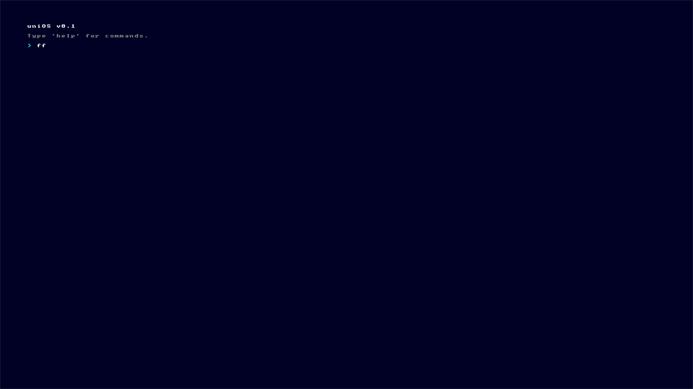

# uniOS



> **A minimal, 64-bit operating system kernel built from scratch.**


**uniOS** is an exploration into the depths of low-level systems programming. Built with a philosophy of transparency and modern design, it aims to be a clean, hackable educational resource for understanding how operating systems work on the metal.

Current Version: **v0.1**

---

## ✨ Features

*   **Modern Core**: Custom C++20 kernel with minimal assembly stubs.
*   **Boot Protocol**: Powered by **Limine** (v8.x) for a seamless, quiet boot experience.
*   **USB Stack**: Native xHCI driver with support for HID devices (Keyboard & Mouse).
*   **Visuals**: Direct framebuffer access with custom font rendering and a sleek dark theme.
*   **Architecture**: Full GDT, IDT, and interrupt handling setup.

## ⚠️ Known Issues (Real Hardware)

While uniOS runs perfectly in emulators, real hardware can be unpredictable:
*   **USB Mouse**: May not function on some controllers due to interrupt transfer quirks. *Fallback: PS/2 mouse support is active.*
*   **ACPI Poweroff**: Shutdown may hang on systems requiring strict ACPI AML parsing. *Fallback: Manual power off may be required.*
*   **Scroll Performance**: Scrolling may be slower on high-resolution displays (4K+) due to unoptimized framebuffer movement.

## 🚀 Getting Started

### Prerequisites
*   `gcc` (cross-compiler for `x86_64-elf`)
*   `nasm`
*   `xorriso`
*   `qemu-system-x86_64`

### Build & Run

```bash
# Clone the repository
git clone https://github.com/92qryg6psz-byte/uniOS.git
cd uniOS

# Build Limine (one-time setup)
git clone https://github.com/limine-bootloader/limine.git --branch=v8.x-binary --depth=1
make -C limine

# Compile and emulate
make run
```

## 📂 Structure

| Directory | Description |
|-----------|-------------|
| `kernel/` | Core kernel source code (C++). |
| `boot/` | Bootloader configuration files. |
| `libc/` | Custom C standard library implementation. |
| `userspace/` | User-mode applications and shells. |

## 📄 License

This project is licensed under the MIT License - see the [LICENSE](LICENSE) file for details.

---
*Crafted with ❤️ by skyyii*
